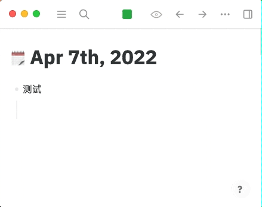

中文 | [English](README.en.md)

# logseq-plugin-media-ts

本插件能够生成视频、音频以及 B 站视频的时间戳，点击时间戳后会跳转到对应的音视频位置。

## 使用展示

插入媒体文件（视频、音频），支持网络上的 URL，本地全路径的文件和已上传至 Logseq 的相对路径的文件。




观看视频的同时记录笔记。


## 使用示例

推荐在插件设置界面设置快捷键并用快捷键快速插入时间戳。也可以使用 `/Media timestamp` 来插入以下代码。请参看上方动图。

对于`video`与`audio`标签可在插入时间戳时自动获取当前位置。对于 B 站视频，出于 Logseq 本身的一些安全性限制，无法获取当前位置，点击时间戳跳转时也不能直接定位，需要重新加载播放器。

你可以先将媒体地址拷贝下来，再用 `/Insert media` 插入，这样命令可以自动帮你正确处理视频地址，无论它是一个网址，本机文件的绝对路径，还是已上传到 Logseq 的一个资源的相对路径。

可以传“秒数”，也可以传“分:秒”或“时:分:秒”。

```
{{renderer :media-timestamp, 60}}
{{renderer :media-timestamp, 01:00}}
{{renderer :media-timestamp, 00:01:00}}
```

如果想为特定块中的媒体创建时间戳可以再传入它的引用，例如：

```
{{renderer :media-timestamp, 60, ((63158bf5-1436-41e4-a8af-a4a03b8b5a5b))}}
```

## 自定义样式

你可以通过以下 CSS 类来自定义样式。参照 Logseq 自定义样式的文档操作，将内容放在`custom.css`中即可。

```css
.kef-media-ts-ts {
}
```

## Buy me a coffee

如果您认为我所开发的软件对您有所帮助，并且愿意给予肯定和支持，不妨扫描下方的二维码进行打赏。感谢您的支持与关注。

 
