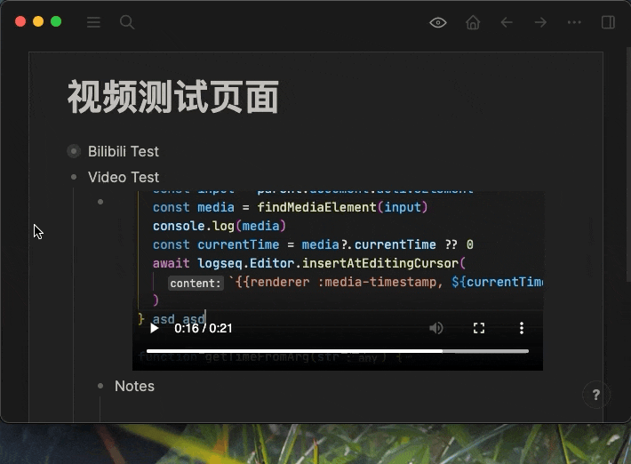

# logseq-plugin-media-ts

本插件能够生成视频、音频以及 B 站视频的时间戳，点击时间戳后会跳转到对应的音视频位置。

This plugin can generate timestamps for video, audio and Bilibili video, it takes you to the corresponding video/audio position when clicked.

## 使用展示 (Usage)


观看视频的同时记录笔记。

Take notes while you watch the video.



## 使用示例 (Examples)

推荐使用 `/Media timestamp` 来快捷插入以下代码。请参看上方动图。

对于`video`与`audio`标签可在插入时间戳时自动获取当前位置。对于 B 站视频，出于 Logseq 本身的一些安全性限制，无法获取当前位置，点击时间戳跳转时也不能直接定位，需要重新加载播放器。

It is recommended to use `/Media timestamp` for quick inserts. Please refer to the above animated gif.

For `video` and `audio` tags, the current playing position can be obtained automatically when inserting the timestamp. For Bilibili videos however, due to security limitations in Logseq, it is not possible to obtain its current playing position and when you click on the timestamp later, a reloading of the player can not be avoided.

```
/Insert video
/Insert audio
```

可以传“秒数”，也可以传“分:秒”或“时:分:秒”。

You can pass in "number of seconds", "minutes:seconds" or "hours:minutes:seconds".

```
{{renderer :media-timestamp, 60}}
{{renderer :media-timestamp, 01:00}}
{{renderer :media-timestamp, 00:01:00}}
```

## 用户配置 (User configs)

```json
{
  "disabled": false,
  "mediaTsShortcut": ""
}
```

在 Logseq 的插件页面打开插件的配置后，有以下几项配置可供使用，请参照上方代码块进行设置（各项的默认值以体现在代码块中）：

- `mediaTsShortcut`: 为生成 media-timestamp 设置快捷键，例如`mod+shift+m`。

There are a couple of user settings available when you access the plugin settings from Logseq's plugins page. Please refer to the source block above (Default values are given in the source block).

- `mediaTsShortcut`: Assign a shortcut for media-timestamp operation, e.g. `mod+shift+m`.

## 自定义样式 (Syle Customization)

你可以通过以下 CSS 类来自定义样式。参照 Logseq 自定义样式的文档操作，将内容放在`custom.css`中即可。

You can customize styles using the following CSS classes. Refer to Logseq's document for how to customize styles, place your modifications in `custom.css`.

```css
.kef-media-ts-ts {
}
```
